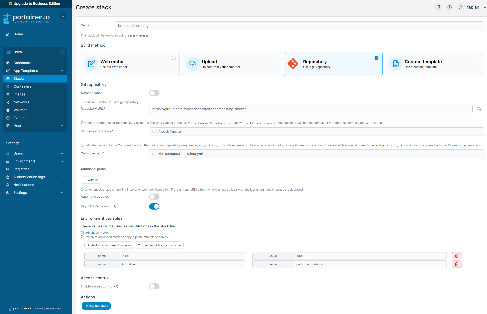

# Breitbandmessung.de Docker Container

# ORIGINAL IMAGE
[](https://github.com/JulKramer3G/breitbandmessung-docker/actions/workflows/build_original_image.yml)
Automatically builds the docker container for the GitHub container registry of repo https://github.com/fabianbees/breitbandmessung-docker

# CUSTOM IMAGE
[](https://github.com/JulKramer3G/breitbandmessung-docker/actions/workflows/build_custom_image.yml)
Builds this repository for the GitHub container registry.
## Changes in custom image: 
- Brought back clipboard check for "RUN" string to activate script


## Deploy via docker-compose (recommended)

Deploy container via docker-compose v3 schema:

```bash
git clone https://github.com/fabianbees/breitbandmessung-docker.git

cd breitbandmessung-docker

docker compose up
```

The container gets build automatically.


```yaml
version: "3.8"
services:
  breitband-desktop:
    image: breitband:latest
    build: .
    container_name: breitband-desktop
    environment:
      - TZ=Europe/Berlin
    volumes:
      - $PWD/breitbandmessung/data:/config/xdg/config/Breitbandmessung
    ports:
      - 5800:5800
    restart: unless-stopped
```


## Deploy as Portainer Stack




## Deploy via docker run

### Building the Container

First you have to build the docker container localy, due to licencing I will not provide a prebuild image of the app.

You can do this with the following commands:

```bash
git clone https://github.com/fabianbees/breitbandmessung-docker.git

cd breitbandmessung-docker

docker build -t breitband:latest .
```

### Run the Container

Then the container can be run via docker:

```bash
docker run -d \
    --name breitband-desktop \
    -e TZ=Europe/Berlin \
    -v $PWD/breitbandmessung/data:/config/xdg/config/Breitbandmessung \
    -p 5800:5800 \
    breitband:latest
```

Appdata for the Breitbandmessung Desktop App lives in the following directory (inside the container): ```/config/xdg/config/Breitbandmessung```. Therefore this directory can be mounted to a host directory.


## Automated Speedtesting

1. Open your browser with the following url: http://ip-of-docker-host:5800


2. Go throgh setup process, until you reach the following page:

**DO NOT KLICK THE BUTTON "Messung durchführen" if you want to use the Speedtest automation script!**
--> The automation script requires this exact screen to be shown for the automatic execution of a "Messkampagne".

3. open a console (bash) to your docker container (```docker exec -it breitband-desktop bash```) and execute the following command inside this docker container:
```bash
touch /RUN
```
This creates a empty file called ```RUN``` in the root directory of the container, the automation script is looking for this file for knowing when the setup process has finished and speedtesting can start.

4. Speedtesting get's started, the script tries to click through the buttons for running a speedtest every 5 minutes. If the countdown timer (waiting period) has not finished yet, the cilcks will do nothing.

5. When all mesurements are done, the automation-script can be stopped by removing the ```/RUN``` file with the following command ```rm /RUN``` inside the docker container


## Additional Notes

- The automation-script is configured, to run speedtests only after 7:30 AM, becaus it is assumed, that the network load between 0 o'clock and 7:30 AM is lower than it is under normal use during the day.
(This behaviour could be alterd, by changing the values in the **if statement in line 18** of the file ```run-speedtest.sh``` before building the docker image).
- If you want to have more granular control for when speedtest should be run, the docker container could be stopped when no speedtest should be run, and restarted if testing should continue.
- A "Messkampagne" which is in progrss, can only be stopped, by purging the appdata of the container, or by altering your "Tarifangaben".